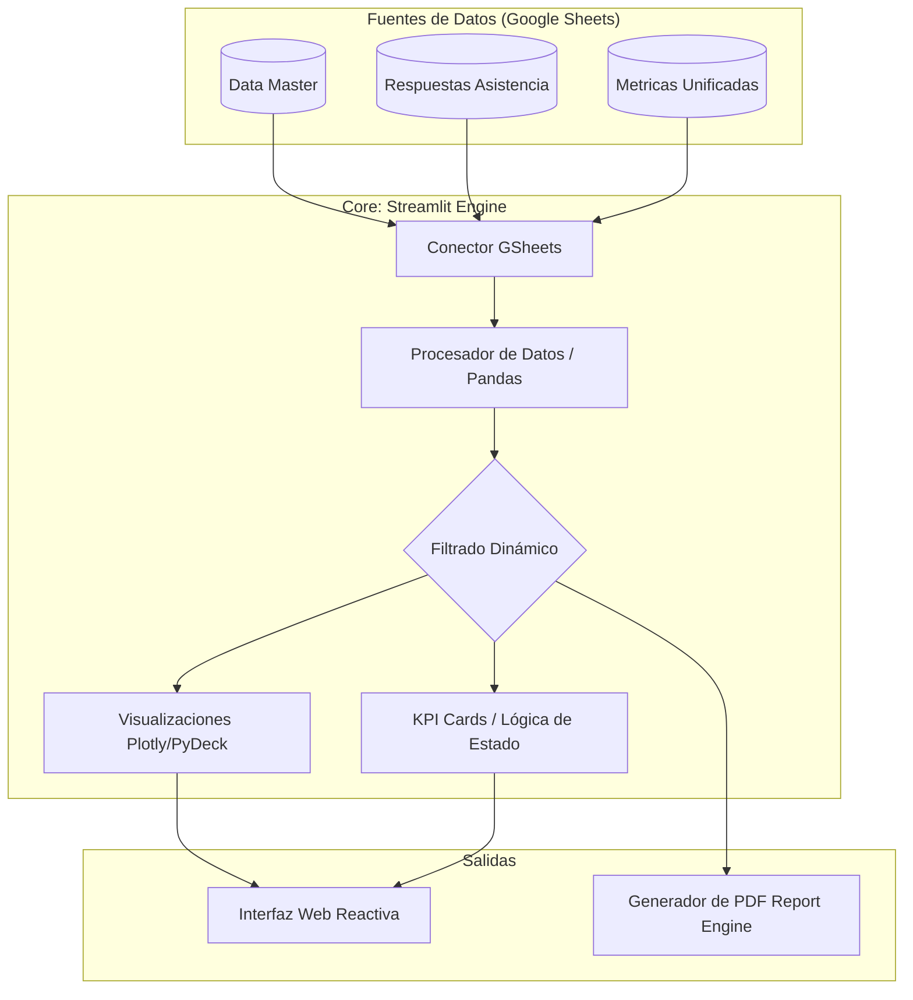

# Command Center v4.1 — Tablero Estratégico Artes para la Paz

Este repositorio contiene la implementación del **Tablero Táctico y Estratégico** para el seguimiento en tiempo real del proyecto "Artes para la Paz" (2026). La aplicación está construida sobre **Streamlit** y ofrece una interfaz de alta fidelidad con estética "Cyber/Neon" para la toma de decisiones basada en datos.

## 🚀 Generalidades del Proyecto

El tablero consolida información dispersa de múltiples fuentes territoriales para proporcionar una visión unificada de:
*   **Estado de Contrataciones**: Seguimiento de artistas formadores (Postulantes vs. Contratados).
*   **Cobertura Territorial**: Impacto en Nodos y Establecimientos Educativos (EE).
*   **Métricas de Asistencia**: Visualización de beneficiarios validados y sesiones realizadas.
*   **Generación de Reportes**: Exportación automatizada en formato PDF con el diseño visual del tablero.

## 🏗️ Arquitectura y Flujo de Datos

El diseño sigue un flujo unidireccional y reactivo para garantizar la integridad de los datos sin comprometer la velocidad.

### Detalle del Flujo:
1.  **Ingesta**: El sistema se conecta vía `st.connection` a hojas de cálculo en la nube, actuando como una "single source of truth" (fuente única de verdad).
2.  **Procesamiento**: Se realizan normalizaciones de IDs (DANE, Cédulas) y cruces de información (joins) entre la disponibilidad de vacantes y la ejecución real en territorio.
3.  **Visualización**: Los datos procesados alimentan gráficos de radar para perfiles de interés, barras apiladas para cobertura por nodo y mapas geoespaciales para ubicación de EE.
4.  **Reporte**: El motor `report_generator.py` (basado en FPDF) traduce el estado actual de los filtros a un documento estático optimizado para impresión.

## 🎨 Diseño Visual
La aplicación utiliza un sistema de diseño personalizado con:
*   **Modo Oscuro Profundo**: Para reducir la fatiga visual.
*   **Acentos de Color**: Cian para cobertura, Verde para validaciones, Magenta para alertas de plataforma y Naranja para metas.
*   **Tipografía**: Uso de familias *Inter* para lectura y *JetBrains Mono* para datos numéricos críticos.

---
**Nota**: Las credenciales de acceso y URLs específicas de datos están protegidas mediante el sistema de secretos de Streamlit y no se incluyen en este repositorio público para garantizar la seguridad de la información crítica del proyecto.
